<!-- filepath: /workspaces/ding-dang/README.md -->

<h1 align="center">🐾 叮当的相册 🐾</h1>

  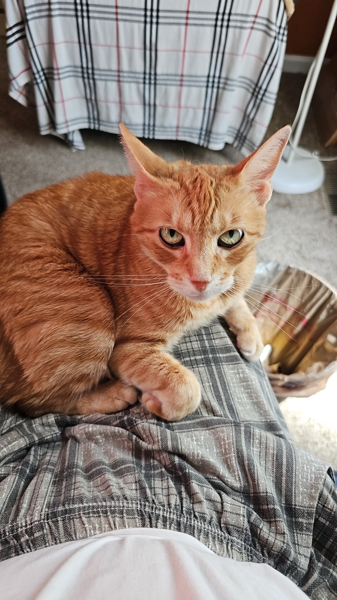

  <b>我是叮当</b>，Maggie的猫咪，今年10岁啦！ 
  感谢她十年来的陪伴，希望她健康快乐每一天。

---

<table>
  <tr>
    <td></td>
    <td>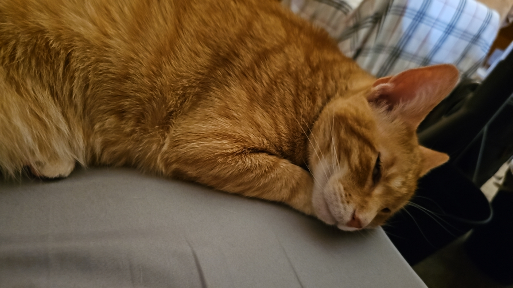</td>
    <td>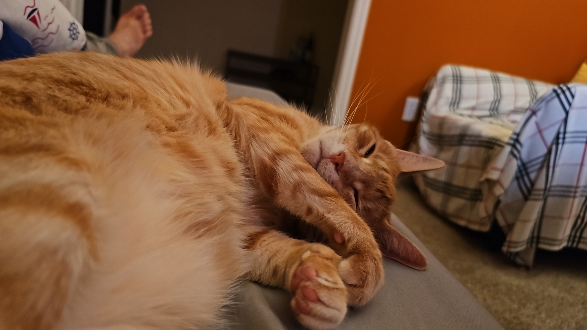</td>
  </tr>
  <tr>
    <td>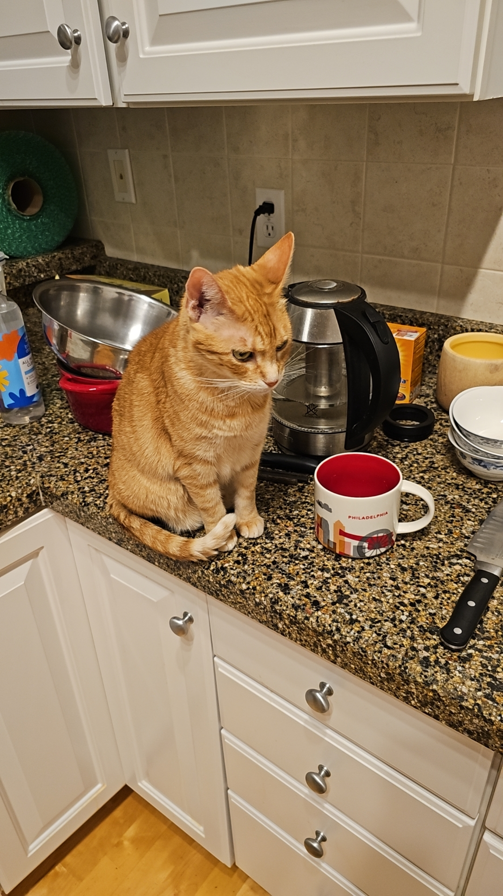</td>
    <td>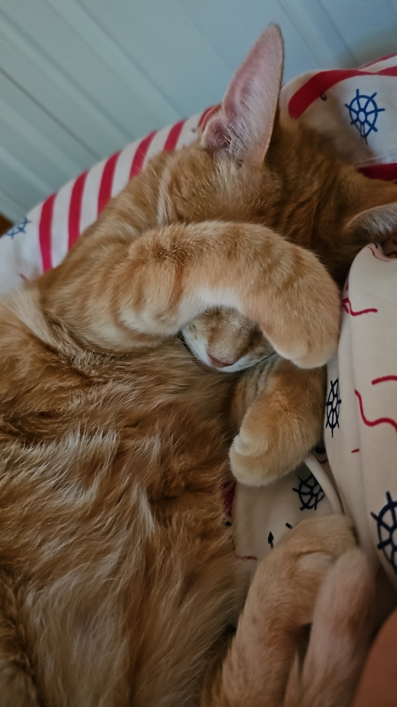</td>
    <td>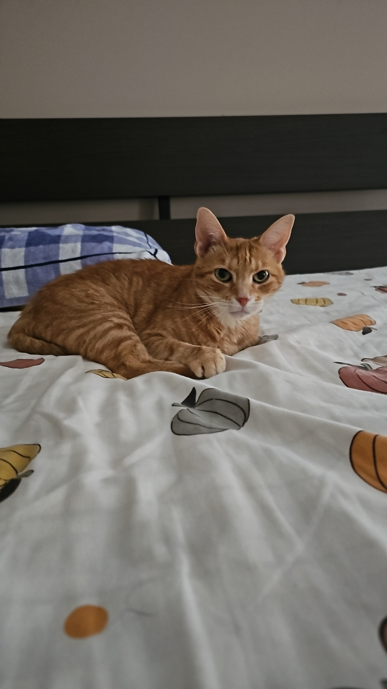</td>
  </tr>
  <tr>
    <td></td>
    <td>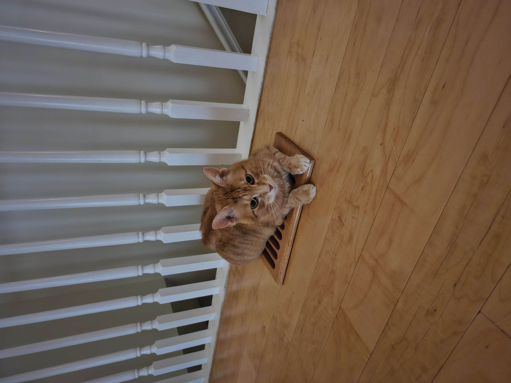</td>
    <td></td>
  </tr>
  <tr>
    <td>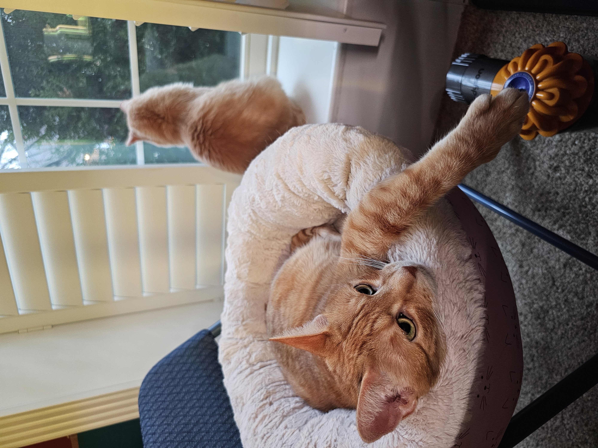</td>
    <td>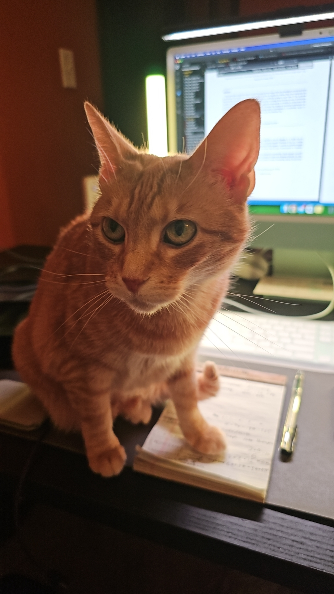</td>
    <td>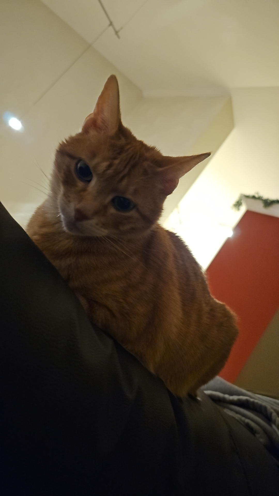</td>
  </tr>
  <tr>
    <td>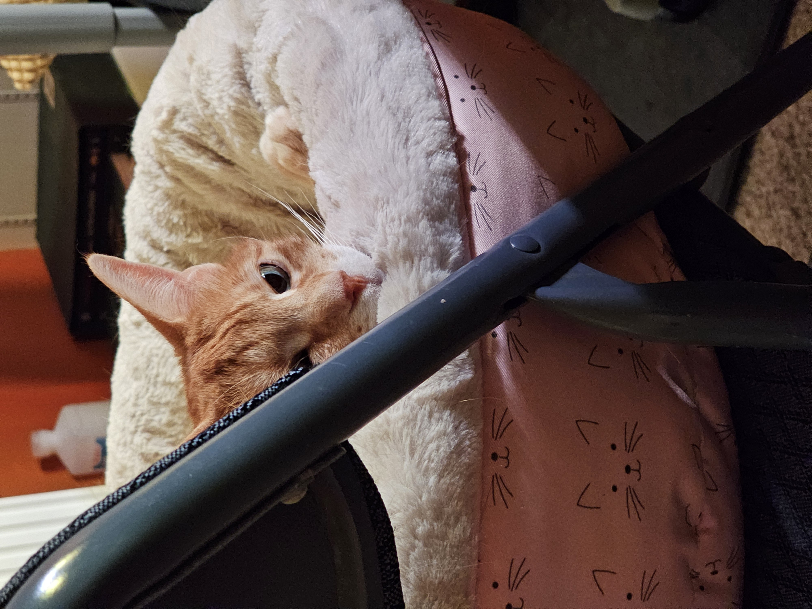</td>
    <td>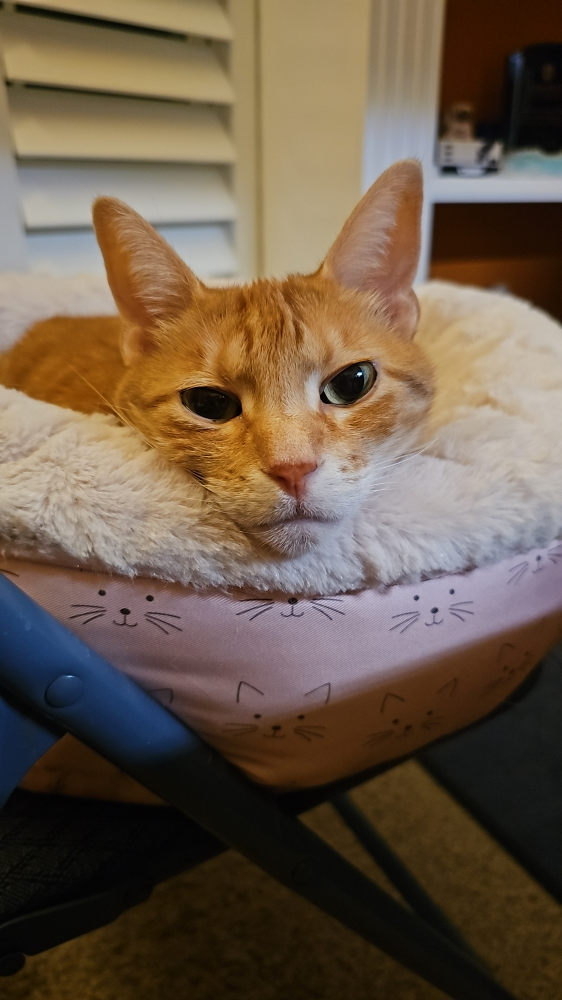</td>
    <td>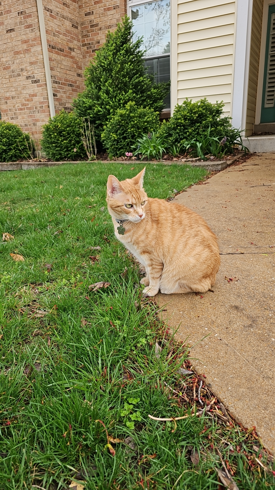</td>
  </tr>
  <tr>
    <td></td>
    <td>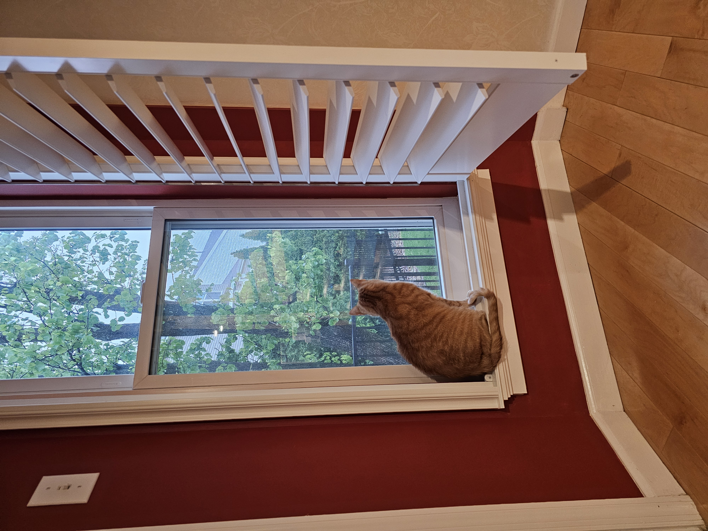</td>
    <td></td>
  </tr>
  <tr>
    <td></td>
    <td></td>
    <td></td>
  </tr>
  <tr>
    <td>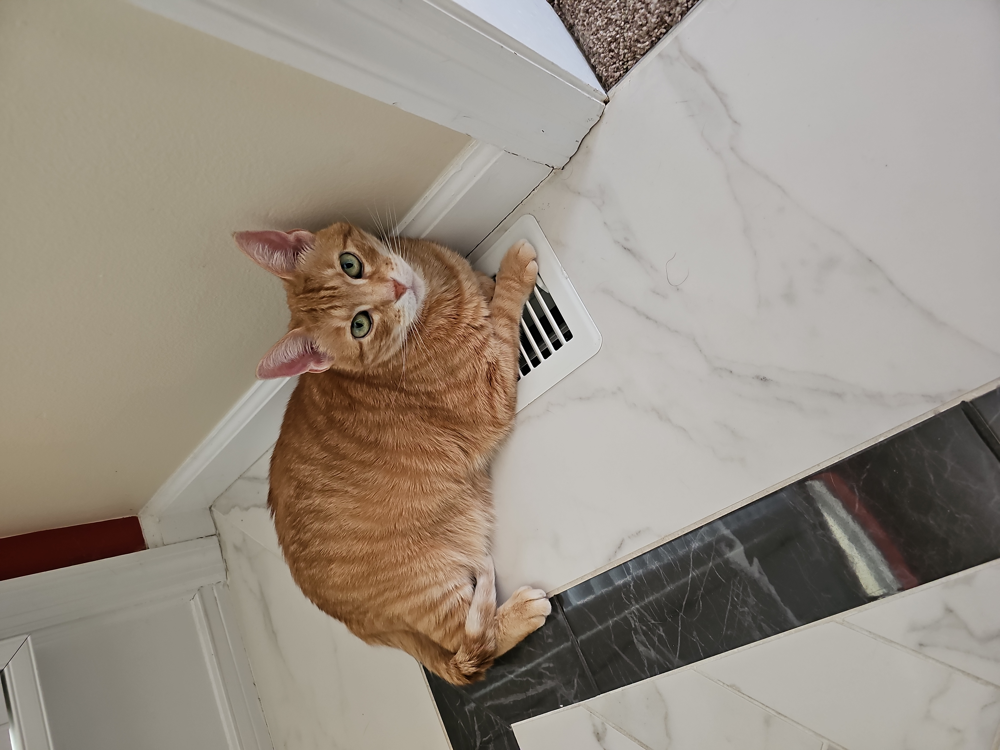</td>
    <td>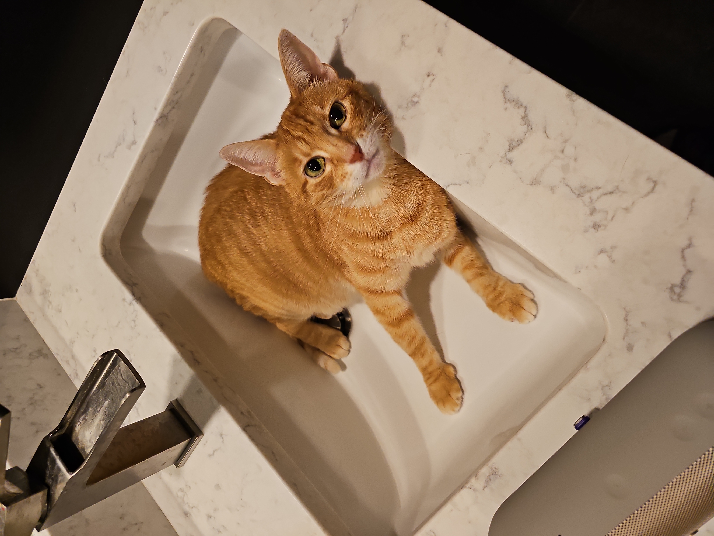</td>
    <td></td>
  </tr>
</table>

---

  🐱 叮当的每一天都值得被记录 🐱

